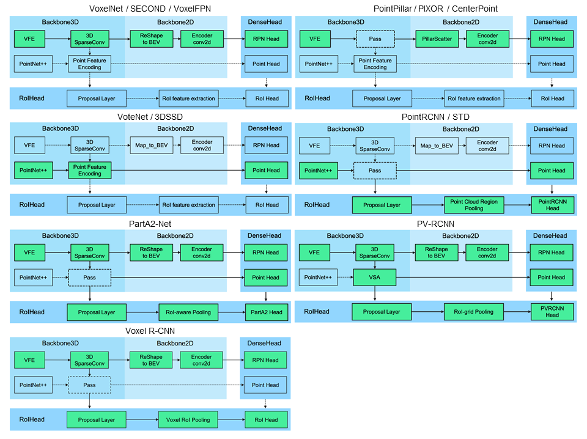

This repo deals with the the challenges in Point Clouds for 3D Object Detection in the Semi-Supervised Learning setting of 1% labeled annotation. We utilize embedding-level information to construct the decision boundary. We implement a feature bank with instancewise feature guidance, and perform information exchange between labeled and pseudo-labeled feature-level information to improve mean Average Precision across Car, Pedestrian and Cyclist classes with varying levels of difficulty.  Our baseline is 3DIoUMatch with PV-RCNN backbone. Performance of our methods are elucidated in the image below. As shown, with improved feature-level guidance, our methods improve the performance of the vulnerable, data-imbalanced classes of Cyclist and Pedestrian.


<p align="center">
  
</p>


# About OpenPCDet Framework
`OpenPCDet` is a general PyTorch-based codebase for 3D object detection from point cloud.  As an open source project for LiDAR-based 3D scene perception that supports multiple LiDAR-based state-of-the-art perception models with highly refactored codes for both one-stage and two-stage 3D detection frameworks. Examples include Point-RCNN, PV-RCNN, PV-RCNN++, CenterPoint, SECOND, MPP-Net, and several others.


### `OpenPCDet` design pattern

* Data-Model separation with unified point cloud coordinate for easily extending to custom datasets:
<p align="center">
  
</p>

* Unified 3D box definition: (x, y, z, dx, dy, dz, heading).

* Flexible and clear model structure to easily support various 3D detection models: 
<p align="center">
  
</p>

* Support various models within one framework as: 
<p align="center">
  
</p>


### Currently Supported Features

- [x] Support both one-stage and two-stage 3D object detection frameworks
- [x] Support distributed training & testing with multiple GPUs and multiple machines
- [x] Support multiple heads on different scales to detect different classes
- [x] Support stacked version set abstraction to encode various number of points in different scenes
- [x] Support Adaptive Training Sample Selection (ATSS) for target assignment
- [x] Support RoI-aware point cloud pooling & RoI-grid point cloud pooling
- [x] Support GPU version 3D IoU calculation and rotated NMS 


## Installation

Please refer to [INSTALL.md](docs/INSTALL.md) for the installation of `OpenPCDet`.

## Quick Demo
Please refer to [DEMO.md](docs/DEMO.md) for a quick demo to test with a pretrained model and 
visualize the predicted results on your custom data or the original KITTI data.

## Getting Started

Please refer to [GETTING_STARTED.md](docs/GETTING_STARTED.md) to learn more usage about this project.


## License

`OpenPCDet` is released under the [Apache 2.0 license](LICENSE).

## Acknowledgement
`OpenPCDet` is an open source project for LiDAR-based 3D scene perception that supports multiple
LiDAR-based perception models as shown above. Some parts of `PCDet` are learned from the official released codes of the above supported methods. 
We would like to thank for their proposed methods and the official implementation.   


## Citation 
If you find this project useful in your research, please consider cite:


```
@misc{openpcdet2020,
    title={OpenPCDet: An Open-source Toolbox for 3D Object Detection from Point Clouds},
    author={OpenPCDet Development Team},
    howpublished = {\url{https://github.com/open-mmlab/OpenPCDet}},
    year={2020}
}
```

